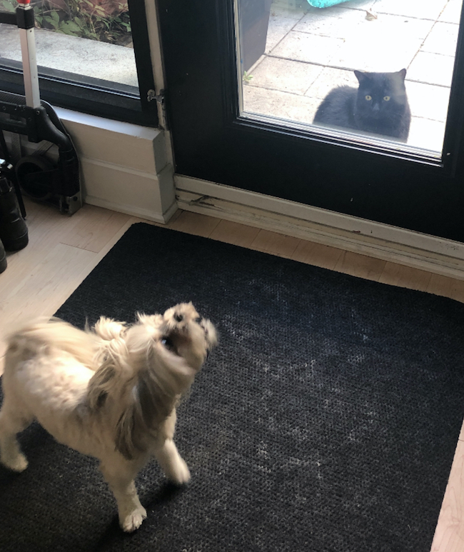

# Luna vs. Henri

## Introduction

I decided to theme my game based on the true story of my dog and her relationship with my next-door neighbours cat. The cat will sit in front of my front door and stare at my dog through the glass, while my dog goes crazy. The cat loves to taunt my dog, and it is hilarious to watch.

Here's what Luna and Henri's interactions really look like:

## Changes I made

I changed the background and the player / enemy avatars.
I photoshopped real photos of the cat & my dog, and then adjusted their pixel size. I fixed the collision sequence. I added a description / instruction box for the game, and styled that. I also added a timer that starts at 0, which counts the seconds (and possibly minutes) the player has lasted until the game over. I also changed the description of the window alert.

## Changes I wish I could have made

I tried to implement a different window alert for 'game over' that popped up in the middle of the screen when the game was finished, but I wasn't able to successfully implement this in time, which bugs me! If I had more time, I really would have liked to add a sound for "if game over" - I wanted to have an angry cat sound to symbolize game over. I also wanted to have a "try again" button that would refresh the game.
